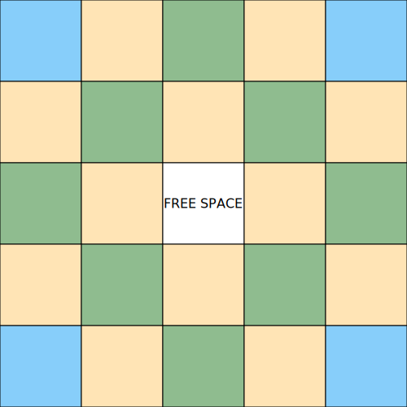

# BINGO
Author: Nathan Wisla

This repository contains a light web app that will spin up a customized random bingo card based on categorized input from a CSV.

## How it works

The board contains 3 different categories:

| Color  | Meaning                                   | Quantity (at least) |
| ------ | ----------------------------------------- | ------------------- |
| blue   | Participation prompts (static/randomized) | 4                   |
| yellow | General information   (randomized)        | 12                  |
| green  | Community information (randomized)        | 8                   |

To fill out the card, simply supply the web app with a CSV containing three columns with headers. In order for content to appear in the right square, you must specify the color somewhere in the column name. The column's name does not need to be only the name of the color, but the color **must** be  included in the column's name. Include the word `yellow` for the column's contents to fill yellow spaces, `green` to fill green spaces, and `blue` for blue spaces.

**Tips:**

**Printing:**
* To print the card, press `ctrl+P` and select `Microsoft Print to PDF`.
* The inputs at the top of the app will not appear when printing.
* Margins _should_ be at 1 inch. If it is less than that, you can set custom margins in the printing options.
* You can remove headers and footers from the printout by setting the option.

**Inputs:**
* The script works by parsing a CSV file and randomly selecting from blue and yellow categories. If you supply anything that does not include `blue`, `green`, or `yellow` in the column's name, **the contents of that column will not appear on the bingo card**.
* The four corners of the card (`blue`) have default values. If a `blue` column in the CSV is not supplied, default values will be placed statically on the card. If you wish to overwrite the corners after the randomization occurs, fill out the corner inputs on the page.
* For the bingo card to randomize, it will require you to supply the CSV. You can create a CSV by starting an Excel file and saving the output as a CSV.
* Once you select your CSV, you may click _randomize_ as many times as you wish.
* (_optional_) You may select a picture to be set in the middle FREE SPACE. **_please ensure that your image is square_**. 

